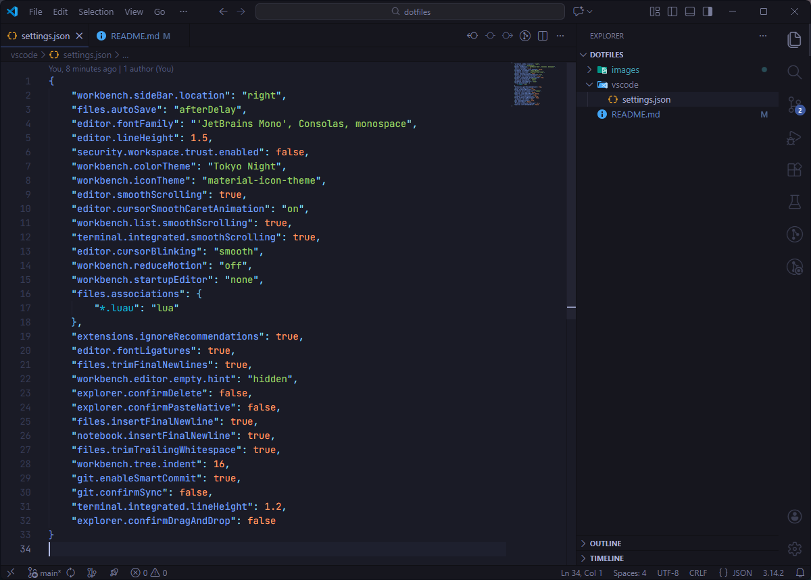

# dotfiles

My config, settings, and dotfiles.

## Windows quick-install

> [!WARNING]
> This will overwrite your current settings.

Run the [Powershell script](Install-Config.ps1).

## Visual Studio Code

User settings: [settings.json](vscode/settings.json)

Extensions needed:
- [Tokyo Night](https://marketplace.visualstudio.com/items?itemName=enkia.tokyo-night)
- [Material Icon Theme](https://marketplace.visualstudio.com/items?itemName=PKief.material-icon-theme)

Fonts needed:
- [JetBrains Mono](https://www.jetbrains.com/lp/mono/)
